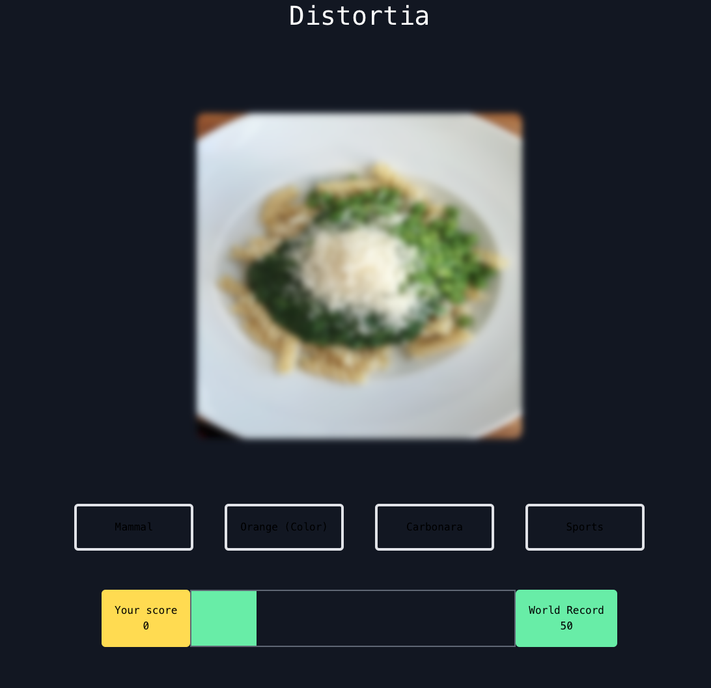

# Distortia

Distortia is a react based image guessing game that let's players guess an image as it gets progressively distorted. The images come from the OpenImage Dataset and are stored on MongoDB Atlas
- Frontend: React, Tailwind CSS
- Backend: NodeJS, Express



## To run the app
1. Start the backend server
```
$ cd nodeServer
```
```
$ npm run dev
```
2. Start the frontend-react
```
$ cd frontEnd
```
```
$ npm start
```

## TO DO
- Implement the max score tracking
- Figure out how to use formated strings as Taiwlind CSS classes